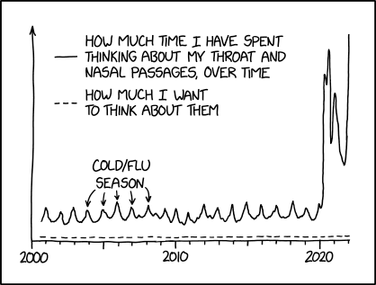

```{r include=FALSE}
set.seed(123)
knitr::opts_chunk$set(fig.align="center", fig.dim=c(6, 4), out.width="4in")
rm(list=ls())
library(lubridate)
library(car)
library(xts)
library(zoo)
library(forecast)
library(tsbox)
source("myfunctions.R")
```

# Time series

## La classe `ts`

Le serie temporali vengono create con la funzione nativa `ts(data, start, end, frequency)`, dove:

* `data` è un vettore di dati equi-spaziati nel tempo
* `start` è la data della prima osservazione
* `end` è la data dell'ultima osservazione
* `frequency` è il numero di osservazioni per unità temporale

Il significato dell'unità tempo base è arbitrario: se ad esempio indichiamo `start=2019` e `frequency=12` significa che i dati partono dal 2019 e hanno cadenza mensile. È possibile indicare `start=c(2019,6)` per stabilire che il primo dato è di Giugno 2019. **NOTA**: `start` deve essere o uno scalare o un vettore di due elementi, nel cui caso il secondo elemento è l'indice (base 1) del sotto-periodo quando `frequency` è maggiore di 1.

Le opzioni `end` o `deltat` possono essere indicate quando si vuole troncare il vettore di ingresso.

{width=3in}

Come dati di esempio, carichiamo i dati della pandemia COVID-19 da [Our World in Data](https://ourworldindata.org):

```{r}
url <- "https://covid.ourworldindata.org/data/owid-covid-data.csv"
datafile <- basename(url)
if (!file.exists(datafile) | difftime(now(),  file.mtime(datafile), units="hours") > 24 ) {
  print("Downloading new data from the Internet")
  download.file(url, datafile)
}
covid <- read.csv(datafile)
```

Dell'intero set di dati filtriamo e selezioniamo solo i nuovi casi per milione in Italia, costruendo poi un oggetto time series. Usiamo la libreria `lubridate` per semplificare la gestione delle date:

```{r warning=FALSE}
st <- decimal_date(ymd(covid[covid$location=="Italy",]$date[1]))
cpm <- ts(
  covid[covid$location=="Italy",]$new_cases_per_million,
  start=st,
  frequency=365.25
)
plot(cpm,
     main="COVID-19 nuovi casi in Italia",
     sub="In casi giornalieri per milione di abitanti",
     xlab="Data",
     ylab="Nuovi casi (/1E6)",
     xaxs="i"
     )
grid()
```

Si noti che l'espressione `decimal_date(ymd(covid$date[1]))` converte la data `r covid$date[1]` (una stringa) in un oggetto tempo `r ymd(covid$date[1])` e infine in un valore decimale a base annuale: `r decimal_date(ymd(covid$date[1]))` (*data astrale*):

```{r}
cat("Data astrale: "); print(c(start(cpm), end(cpm)))
cat("Data POSIX: "); print(date_decimal(c(start(cpm), end(cpm))))

```


## Multivarate time series

È possibile creare oggetti timeseries multi-variati, passando all'argomento `data` una matrice con più colonne:

```{r warning=FALSE}
cpmv <- ts(
  data=cbind(
    covid[covid$location=="Italy",]$new_cases_per_million,
    covid[covid$location=="Italy",]$people_vaccinated_per_hundred
  ),
  names=c("NCPM", "VC"),
  start=st,
  frequency=365.25
)
plot(cpmv,
     main="COVID-19 nuovi casi in Italia",
     sub="In casi giornalieri per milione di abitanti",
     xlab="Data",
     ylab="Nuovi casi (/1E6)",
     )
```

## Finestre e Smoothing

Funzioni utili per manipolare le serie temporali sono `window()` e `time()`: la prima consente di estrarre una finestra temporale tra due date, la seconda consente di estrarre il vettore dei tempi. Inoltre, sono utili le funzioni di smoothing fornite dalla libreria `zoo`

```{r warning=FALSE}
win <- window(cpm, start=2021.5, end=end(cpm))
plot(win,
     main="COVID-19 nuovi casi in Italia",
     sub="In casi giornalieri per milione di abitanti",
     xlab="Data",
     ylab="Nuovi casi (/1E6)",
     xaxs="r"
     )
lines(rollmean(win, 7), typ="l", col=2)
lines(rollmedian(win, 7), typ="l", col=3)
lines(ksmooth(time(win), win, "normal", bandwidth=1/(365.25 / 7)), col=4)
legend("topleft", lty=1, col=2:4, legend=c("rollmean", "rollmedian", "kernel"))
```

## Consolidamento

È spesso utile consolidare una serie temporale per sotto-periodi: ad esempio trasformare una serie giornaliera come `cpm` in una serie mensile o settimanale. La libreria `xts` mette a disposizione le funzioni `apply.[dayly|wekly|monthly|quarterly|yearly]()`, che però operano su un differente tipo di oggetti, appunto la classe `xts`. La libreria `tsbox` contiene appunto la funzione `ts_xts()` per convertire un `ts` in un `xts`:

```{r}
cpmm <- apply.weekly(ts_xts(cpm), sum)
plot(cpmm)
```

Ora `cpmm` è un oggetto `xts`: la conversione di nuovo verso `ts` può essere fatta così:

```{r}
cpmm <- ts(coredata(cpmm), 
           start = decimal_date(index(cpmm)[1]),
           frequency = 365.25/7)
ts.plot(cpmm, ylab="Numero casi settimanali")
```

## La classe `xts`
In realtà, la classe `xts` è molto più potente di `ts` nella *gestione* della serie temporale, ed è quindi in certi casi preferibile. Invece che convertire `cpm` come fatto sopra, vediamo come creare direttamente un oggetto `xts`:

```{r}
cpmx <- xts(covid[covid$location=="Italy",]$new_cases_per_million,
            order.by = ymd(covid[covid$location=="Italy",]$date)
            )
```

L'estrazione di sottoinsiemi (subsetting) viene effettuata, anziché con il metodo `window()`, come una semplice indicizzazione (cioè il metodo `[.xts()`). È possibile usare sia indici numerici (convenzionali) sia stringhe in standard ISO-8601. La data può cioè essere espressa come intervallo:

```{r}
plot(cpmx["202108/2021-09-30"])
# p1 <- autoplot(cpmx["202108/2021-09-30"]) + 
#   geom_line() + 
#   geom_area(fill="gray", alpha=1/3) + 
#   geom_line(data=cpmx["2021-10-1/"], aes(x=Index, y=cpmx["2021-10-1/"]))
# p1
```
La data di inizio (prima di `/`) o di fine dell'intervallo (dopo la `/`) possono essere omesse, in tal caso significa "dall'inizio fino a ..." oppure "da ... fino alla fine". Inoltre, è possibile omettere componenti della data, intendendo così un intero sotto-periodo:

```{r}
length(cpmx["2021"]) # Tutto l'anno
length(cpmx["2021-6"]) # Tutto Giugno
last(cpmx, "2 week") # Ultime due settimane
plot(first(cpmx["2021"], "2 weeks")) # Prime due settimane del 2021"
```
Infine, la funzione `endpoints()` consente di identificare gli indici della serie a cui terminano specifici periodi (anno, mese, settimana, giorno...).
Ad esempio, per selezionare i dati fino all'ultima domenica:

```{r}
plot(cpmx[1:(last(endpoints(cpmx, on="weeks")-1))]["2021-11/"])
```

Ci sono anche utili funzioni per convertire il periodo in un periodo più lungo: ad esempio, da una serie giornaliera ad una serie settimanale mediante `to_weekly()`. Questi comandi restituiscono quattro serie "OHLC": *Opening, High, Low, Closing*, cioè il primo valore del sotto-periodo, il massimo, il minimo e l'ultimo valore:

```{r}
plot(to.weekly(cpmx))
```

La classe `xts` è quindi molto potente ma ha alcuni punti deboli:

* non va molto d'accordo con le funzioni `Arima()` e `predict()`: gli oggetti regressione che si ottengono sono convertiti nella classe base `ts` ma perdono l'informazione temporale (quindi iniziano con tempo 1 e hanno passo 1)
* il metodo `xts.plot()` è apparentemente più carino, ma molto meno flessibile dell metodo generico: ad esempio è molto complesso estendere una serie sullo stesso plot con dati successivi.

Per questi motivi, si consiglia l'uso di `xts` per la gestione della serie temporale, l'estrazione di sotto-periodi e l'eventuale aggregazione, ma poi si consiglia di convertire di nuovo in `ts` mediante il metodo `ts_ts()` prima di effettuare le regressioni.


# Regressione e Predizione

## Verifiche iniziali

La prima verifica è sempre quella sui dati mancanti. Eliminiamo qualche dato dalla serie `cpm` per vedere, in seguito, come gestire i dati mancanti:

```{r}
cpmx[c(30, 213, 401)] <- NA
```

Decidiamo di sostituire i dati mancanti con la mediana dei dati adiacenti:

```{r}
nas <- which(is.na(cpmx))
for (i in nas) {
  cpmx[i] = median(cpmx[i-1], cpmx[i+1])
}
```

Prima di qualsiasi analisi su una serie temporale è utile visualizzare il cosiddetto **lag plot**, che è un particolare grafico a dispersione in cui si confrontano i dati di una serie con gli stessi dati con un certo ritardo: se il segnale è puramente casuale, il risultato sarà una nuvola dispersa; viceversa, ogni pattern significa che i dati sono affetti da un andamento regolare. Inoltre, nel nostro caso si nota che la dispersione è molto stretta al lag 7, il che dimostra la regolarità settimanale della serie temporale.

```{r}
lag.plot(log(cpmx["2021-06/"]), lags=9)
lag.plot(runif(length(cpmx["2021-06/"])), lags=9)
lag.plot(rnorm(length(cpmx)), lags=9)
```

## Auto-ARIMA

La libreria `forecast` mette a disposizione il metodo più semplice per effettuare la regressione di una serie temporale mediante ARIMA (*Auto-Regressive Integrative Moving Average*). Mettiamolo alla prova sulla serie temporale COVID-19, addestrando il modello fino alla data `r paste0("2021.7 = ", date_decimal(2021.7))`, utilizzando il modello per predire i successivi 30 giorni, e poi confrontandolo con i dati reali.

Si noti che le funzioni `auto.arima()` e `forecast()` perdono l'asse dei tempi quando vengono utilizzate su oggetti `xts`, quindi usiamo `xts` per selezionare i peridi (più comodo) ma convertiamo in oggetti `ts` per l'analisi:

```{r}
d0 <- "/2021-08-20"
d1 <- "2021-08-21/"
win <- ts_ts(cpmx[d0])
(fit2 <- auto.arima(win))
plot(forecast(fit2, 30, level=c(80, 95, 99)),
     xlim=c(-120,+30)/365+decimal_date(ymd(d0))
     )
new <- ts_ts(cpmx[d1])
lines(new, col="red")
```

Vediamo le predizioni odierne:

```{r}
win <- last(cpmx, "16 weeks")
(fit <- auto.arima(ts_ts(win)))
plot(forecast(fit, 30, level=c(80, 95, 99)),
     xlim=c(-60,+30)/365+decimal_date(end(cpmx))
)
abline(v=decimal_date(end(cpmx)))
```

In realtà, le oscillazioni settimanali sono più un artefatto di misura che una proprietà intrinseca del fenomeno, quindi è più corretto effettuare predizioni su, ad esempio, i valori settimanali. Quindi utilizziamo lo stesso oggetto `cpmm` sopra ottenuto sommando i valori settimanali, e ci concentriamo sulla finestra `2021.4` -- `2021.911`. Inoltre, come vedremo più avanti, il metodo ARIMA si applica a serie *stazionarie*, in cui cioè valore medio e varianza sono stabili. Il metodo più comune per stabilizzare la varianza è *trasformare* i dati applicando il logaritmo:

```{r}
cpmm <- apply.weekly(ts_xts(cpm), sum)
win <- ts_ts(cpmm["2021-05-27/2021-11-29"])
# Fino all'ultima domenica
#win <- ts_ts(cpmm[1:(last(endpoints(cpmm, on="weeks")-1))]["2021-6/"])
fit <- auto.arima(log(win))
plot(forecast(fit, h=5))
```

## ARIMA, the hard way

### Parametri del modello
Per calibrare un modello ARIMA è necessario identificare i parametri $p$, $d$ e $q$. 

Anzitutto, un modello ARMA ($d=0$) si può applicare solo ad una serie temporale *stazionaria*, cioè priva di deriva e a varianza costante. Se la serie in questione non ha queste caratteristiche, è possibile applicare delle trasformazioni: ad esempio, possiamo applicare il logaritmo per comprimere la varianza, e differenziare una o più volte per rimuovere la deriva. Il numero di differenziazioni corrisponde al parametro $d$ che trasforma un modello $\mathrm{ARMA}(p,q)$ in $\mathrm{ARIMA}(p,d,q)$.

Il passo successivo è individuare il grado dei processi AR e MA. Per quanto riguarda un processo MA, il suo grado $q$ è il numero di elementi consecutivi interessati alla media mobile: 
$$
x_t = w_t + \theta_1 w_{t-1}+\theta_2 w_{t-2} + \dots + \theta_q w_{t-q}
$$
È evidente, quindi, che i campioni più vicini di $q$ saranno fortemente correlati, mentre quelli più lontani risulteranno non correlati. Possiamo cioè stimare $q$ sulla base della *funzione di autocorrelazione* (ACF), che valuta l'autocorrelazione tra due copie della stessa serie traslate di una certa distanza in passi temporali $h$, detta *lag*:
$$
\mathrm{ACF}(h) = \mathrm{corr}(x_t, x_{t+h})
$$

Tale funzione vale sempre 1 per un lag 0 (autocorrelazione con se stesso), e per un processo $\mathrm{MA}(q)$ va a zero al lag $q+1$.

Per quanto riguarda i processi $\mathrm{AR}(p)$, essi rappresentano un'auto-regressione:
$$
x_t = \phi_1 x_{t-1} + \phi_2 x_{t-2} + \dots +\phi_{p} x_{t-p} + w_t
$$
Per stimare $p$ abbiamo quindi bisogno di stimare la correlazione tra $x_t$ e una sua versione ritardata, eliminando i contributi a lag intermedi. Si costruisce cioè la *funzione di autocorrelazione parziale* (PACF), che riporta, in funzione del lag $h$, l'autocorrelazione avendo eliminato (sostituendolo con una regressione) il contributo tra lag 1 e lag $n-1$:
$$
\mathrm{PACF}(h) = \mathrm{corr}(x_{t+h}-\hat x_{t+h}, x_t-\hat x_t)
$$
dove $\hat x_{t+h} = \beta_1 x_{t+h-q} + \beta_2 x_{t+h-2} + \dots \beta_{h-1}x_{t+1}$ e $x_t = \beta_1 x_{t+1} + \beta_2 x_{t+2}+\dots+\beta_{h-1} x_{t+h-q}$, e i coefficienti $\beta_i$ sono calcolati minimizzando i residui.

Anche in questo caso, il grado del processo $q$ corrisponde al lag al di là del quale la PACF va a zero (*drop-off*).

Quindi, come regola base, dopo aver reso stazionaria la serie storica mediante differenziazione, si studiano ACF e PACF per identificare $q$ e $p$, rispettivamente. Valgono le seguenti linee guida:

* se il processo è AR, la PACF ha un drop-off dopo il lag $p$ e la ACF decade geometricamente
* se il processo è MA, la ACF ha un drop-off dopo il lag $q$ e la PACF decade geometricamente
* se il processo è ARMA, sia ACF che PACF manifestano un drop-off, e possono essere utilizzate per stimare $p$ e $q$; tuttavia esse sono spesso meno chiare che nei casi precedenti
* se un processo è puro noise, né ACF né PACF mostrano alcuna struttura
* eventuali *stagionalità* si mostrano come picchi intensi a lag elevati (corrispondenti al periodo della stagionalità)

Generalmente, a meno che un processo non risulti AR o MA puro, le funzioni ACF e PACF vengono utilizzate per identificare *set* di possibili parametri $p$ e $q$, scegliendo poi la combinazione migliore mediante gli stimatori di bontà della regressione. Il più adatto a questo scopo è AIC (*Akaike Information Criterion*), che deve essere minimizzato.


### Esempio: Anomalia terra-mare

Consideriamo i dati di anomalia termica terra-mare, disponibili su [Our World in Data](https://ourworldindata.org/grapher/temperature-anomaly?country=~Global).

Carichiamo i dati e li importiamo in una serie temporale:

```{r}
datafile <- "temperature-anomaly.csv"
data <- read.csv(mydata(datafile))
t.global <- ts(data[data$Entity=="Global",]$Median.temp, start=1850)
plot(t.global, ylab="Anomalia termica (°C)", main="Anomalia termica globale")
abline(h=0)
```

La serie temporale rappresenta i valori tra `r c(start(t.global), end(t.global))`.

Dividiamo il dataset in due parti: dal `r start(t.global)[1]` fino al 2000, da usare per il training del modello, e una dal `r start(t.global)[1] + 1` fino al `r end(t.global)[1]` da usare per la validazione:

```{r}
temp.global <- window(t.global, end=2000)
temp.global.test <- window(t.global, start=2001)
plot(temp.global, 
     xlim=c(start(temp.global)[1], end(temp.global.test)[1]),
     ylim=c(min(temp.global), max(temp.global.test))
)
lines(temp.global.test, col="red")
```

Un modello ARIMA deve essere applicato ad una serie **stazionaria**: la serie cioè deve avere una varianza stabile nel tempo e non deve mostrare trend. Per stabilizzare la varianza si applicano delle *trasformazioni* alla serie: elevazioni a potenza o logaritmi. Per eliminare i trend si differenzia il segnale una o più volte: il numero di differenziazioni è l'indice di integrazione del modello ARIMA.

La trasformazione migliore è quella che minimizza il coefficiente di varianza della serie. Il metodo Box-Cox è comunemente adottato per individuare il parametro di trasformazione $\lambda$ che minimizza il coefficiente di variazione:

```{r}
(lambda <- BoxCox.lambda(temp.global + 273.15))
```

Si noti che si sono trasformati i dati in gradi Kelvin, dato che il metodo richiede serie di dati strettamente positivi (coinvolge il logaritmo). Il valore di $\lambda$ ottenuto è molto vicino a 1, per cui si ritiene che non sia necessaria alcuna trasformazione.

```{r}
# se lambda fosse diversa da 1, si procederebbe così:
temp.global.BC <- BoxCox(temp.global + 273.15, lambda)
# ma non è necessario...
```

Il prossimo passo è eliminare il trend mediante differenziazione. Il comando `ndiffs()` restituisce l'opportuno ordine di differenziazione per stabilizzare la serie, dopodiché il comando `diff(ts, differences=n)` applica la differenziazione di ordine `n`:

```{r}
(d <- ndiffs(temp.global))
temp.global.diff <- diff(temp.global, diff=d)
plot(temp.global.diff)
```

Come si vede, la varianza è stazionaria e la serie trasformata non mostra tendenze.

A questo punto applichiamo quindi le funzioni di autocorrelazione (`acf`) e di autocorrelazione parziale (`pacf`) per identificare i parametri rispettivamente $q$ e $p$ del modello $\mathrm{ARIMA}(p, d, q)$, avendo già identificato $d$ con il comando `ndiffs`.

```{r}
# Separatamente:
## Pacf(temp.global.diff)
## Acf(temp.global.diff)
# in alternativa:
tsdisplay(temp.global.diff)
```

La `pacf` mostra 3 picchi prima del drop-off, quindi $p=3$. Analogamente, anche la `acf` mostra due picchi prima del drop-off, quindi $q=2$

Possiamo effettuare la regressione ARIMA con i parametri $(3, 1, 2)$. Utilizziamo la funzione `Arima` della libreria `forecast` anziché la versione standard `arima`, dato che la prima consente anche di considerare il trend (o drift). Per confronto, verifichiamo anche il modello ottenuto con `auto.arima`:

```{r}
fit <- Arima(temp.global, order=c(3, 1, 2), include.drift = T)
summary(fit)
fit.auto <- auto.arima(temp.global)
summary(fit.auto)
```

Come si osserva, la versione automatica propone un modello $\mathrm{ARIMA}(2,1,2)$, che ha un parametro AIC leggermente inferiore.

Il prossimo passo è verificare i residui: perché il modello sia adeguato, essi devo essere casuali e normali. La casualità può essere studiata con la `acf`: se la serie temporale è casuale, l'unico indice di correlazione deve essere il primo.

```{r}
acf(fit$residuals)
acf(fit.auto$residuals)
```

La normalità può essere studiata al solito con un diagramma Q-Q:

```{r}
qqPlot(fit$residuals)
qqPlot(fit.auto$residuals)
```
Entrambi i modelli risultano quindi adeguati.

Possiamo infine verificare la predizione, confrontandola con i dati successivi al 2000, per entrambi i modelli:

```{r}
plot(forecast(fit, h=16))
lines(temp.global.test, col="red")
lines(fit$fitted, col="gray")

plot(forecast(fit.auto, h=16))
lines(temp.global.test, col="red")
lines(fit$fitted, col="gray")

## ggplot:
# autoplot(forecast(fit, h=16)) + geom_line(aes(x=index(fit$x), y=fit$fitted), color="gray") + geom_line(aes(x=index(temp.global.test), y=temp.global.test), color="red") + ylab("Anomalia termica (°C)") + xlab("Anno")
```

### Esempio: Seasonal ARIMA (SARIMA)

Consideriamo l'effetto della stagionalità. Utilizziamo la serie storica `AirPassengers` integrata in R.

```{r}
x <- AirPassengers
lx <- log(x) # logaritmo per stabilizzare la varianza
dlx = diff(lx) # prima differenziazione
plot.ts(cbind(x,lx,dlx), main="")
```
La serie `dlx` mostra ancora un evidente periodicità stagionale. Questa può essere evidenziata mediante la funzione `monthplot()`, che raggruppa anni diversi per lo stesso mese:

```{r}
monthplot(dlx)
```
È evidente come i valori per lo stesso mese tendono a raggrupparsi. Possiamo quindi provare a differenziare con lag 12 oltre che con lag 1:

```{r}
ddlx <- diff(dlx, 12)
plot.ts(cbind(x,lx,dlx, ddlx), main="")
monthplot(ddlx)
```

La stagionalità può essere analizzata anche con il metodo `stl()`:

```{r}
plot(stl(x, "periodic"))
```

Si noti che `stl(x, "periodic")` restituisce un oggetto `ts` multi-variato, le cui colonne possono essere estratte, ad es., così: `plot(s$time.series[,"seasonal"])`.

A questo punto studiamo l'autocorrelazione per identificare i parametri del modello SARIMA:

```{r}
tsdisplay(ddlx, lag.max = 4*12)
```

Anzitutto, per eliminare il trend abbiamo differenziato 1 volta sia a lag 1 che a lag 12, quindi i parametri $d$ della parte stagionale e di quella non stagionale saranno entrambi 1. In formula, si scrive che il modello trasformato è $\nabla_{12}\nabla \log x_t$.

Per quanto riguarda i parametri $p$ e $q$, entrambi i diagrammi di autocorrelazione mostrano un forte picco a lag 12 (riprova della stagionalità) e entrambi i grafici mostrano una rapida caduta verso un'oscillazione stabilizzata: dopo un picco a lag 1, sia la PACF che la ACF passano all'oscillazione stabilizzata, quindi $p=1$ e $q=1$.
Dopo il picco a lag 12, invece, la PACF mostra una decrescita geometrica, il che indica il termine $p=0$ (modello AR), mentre la ACF mostra un rapido smorzamento subito dopo il primo picco, che indica $q=1$ nel modello MA. Secondo la notazione comune, il modello appropriato è quindi $\mathrm{ARIMA}(1,1,1)\times(0,1,1)_{12}$, ovvero un modello stagionale con lag 12 con parametri $(1,1,1)$ per la parte non-stagionale, e $(0,1,1)$ per la parte stagionale.

```{r}
(fit1 <- arima(lx, order=c(1,1,1), seasonal=list(order=c(1,1,1), period = 12)))
```

Per sicurezza valutiamo anche il modello $\mathrm{ARIMA}(1,1,1)\times(1,1,1)_{12}$:


```{r}
(fit2 <- arima(lx, order=c(1,1,1), seasonal=list(order=c(1,1,1), period = 12)))
```

Come si nota, il valore di AIC è leggermente inferiore, quindi potremmo adottare il secondo modello ed effettuare una predizione per i successivi 12 mesi:

```{r}
plot(forecast(fit1, h=12))
plot(forecast(fit2, h=12))
```

```{r}
(fit3 <- auto.arima(lx))
plot(forecast(fit3, h=12))
```

# Simulazione di processi ARIMA

Per motivi di studio è spesso utile poter *simulare* un processo ARIMA. A questo scopo possiamo utilizzare la funzione `arima.sim()`, che genera una serie temporale a partire dai termini $p$, $d$, e $q$ del modello desiderato.

Vediamo ad esempio un processo auto-regressivo di tipo $\mathrm{AR}(1)$:

```{r}
set.seed(123)
tsdisplay(arima.sim(model=list(ar=c(0.9)), n=500))
```

Come si vede, la ACF degrada in maniera geometrica mentre la PACF ha un brusco calo sotto la soglia di significatività a lag=1, indice appunto di un modello con $p=1$


Simuliamo invece un processo a media mobile $\mathrm{MA}(2)$:

```{r}
set.seed(123)
tsdisplay(arima.sim(model=list(ma=c(1.5, 0.75)), n=500))
```

Questa volta è la PACF a diminuire geometricamente (seppure con segni alternati), mentre la ACF si smorza rapidamente dopo due lag, per cui si deduce $q=2$.

Vediamo ora l'effetto combinato, $\mathrm{ARMA}(1,2)$, per cui ci aspettiamo $p=1$ e $q=2$:

```{r}
set.seed(123)
x <- arima.sim(model=list(ar=c(0.6, -0.2), ma=c(0.4)), n=1000)
tsdisplay(x)
```

Come si vede, quando entrambi i termini sono presenti i grafici ACF e PACF possono non essere facilmente interpretabili. In questo caso, ad esempio, saremmo portati a proporre un modello $\rm{ARMA}(3, 2)$. Per questo motivo è opportuno, partendo da questa ipotesi, valutare anche condizioni simili e scegliere quella con AIC minimo, che è appunto ciò che fa `auto.arima()`, di cui possiamo vedere il processo mediante il parametro `trace=T`:

```{r}
auto.arima(x, start.p=3, start.q=2, trace=T)
```

È possibile ovviamente generare una serie temporale con un parametro $d$ non nullo:

```{r}
set.seed(123)
ar <- c(0.6, -0.2)
ma <- c(0.4)
d <- 1
order <- c(length(ar), d, length(ma))
s <- arima.sim(model=list(ar=ar, ma=ma, order=order), n=1000)
tsdisplay(diff(s, differences = d))
```
Anche in questo caso possiamo verificare il risultato:

```{r}
auto.arima(s, start.p=3, start.q=2, trace=T)
```

Il numero di differenziazioni necessarie per rendere la serie stazionaria può essere calcolato con `ndiffs()`:

```{r}
(d <- ndiffs(s))
tsdisplay(diff(s, diff=d))
```

Se non volessimo utilizzare `auto.arima()`, potremmo verificare l'AIC di una combinazione di parametri esplorati a tappeto. Le funzioni di autocorrelazione suggeriscono un modello $\mathrm{ARIMA}(3,1,2)$. Il modello ottimale dovrebbe avere quindi una combinazione di $p$ e $q$ inferiori a 3 e 2. Li proviamo tutti e selezioniamo quello con AIC minore:

```{r}
g <- expand.grid(p=1:3, q=1:2, drift=c(F, T), aic=NA)
for (i in 1:dim(g)[1]) {
  g$aic[i] <- Arima(s, order=c(g$p[i], d, g$q[i]), include.drift=g$drift[i])$aic
}
g[which.min(g$aic),]
```

Vediamo come si comporta `auto.arima()` su serie temporali generate in altro modo:

```{r}
n <- 200
t1 <- ts(0.5*rnorm(n), start=2020, frequency = 365.25)
t2 <- ts(sin((1:n)*365.25/(12*n)), start=2020, frequency=365.25)
tsdisplay(t1+t2)
fit <- auto.arima(t1+t2)
```

Possiamo visualizzare la *regressione*, ossia il termine `fit$fitted`:

```{r}
plot(t1+t2, col=1)
lines(fit$fitted, col=2)
legend("topright", legend=c("t1+t2", "ARIMA fit"), lty=1, col=1:2)
```

Infine, ricordiamo sempre di verificare la normalità dei residui:

```{r}
invisible(qqPlot(residuals(fit)))
```